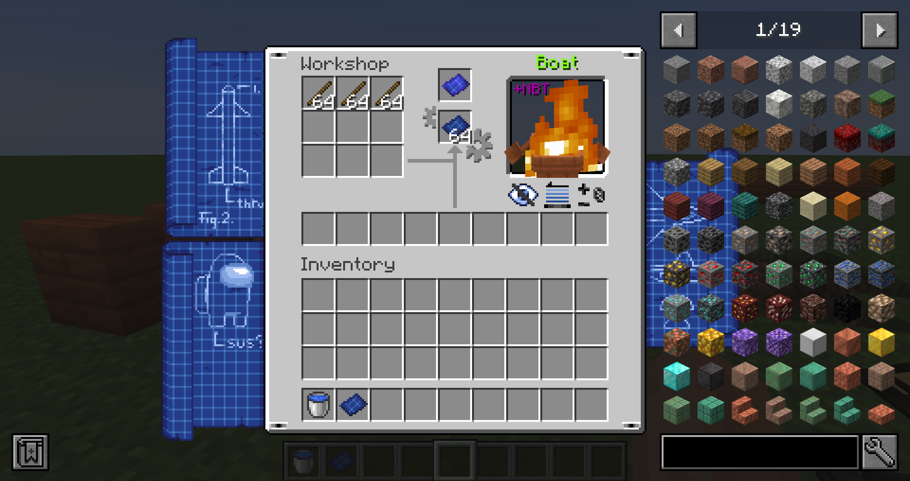
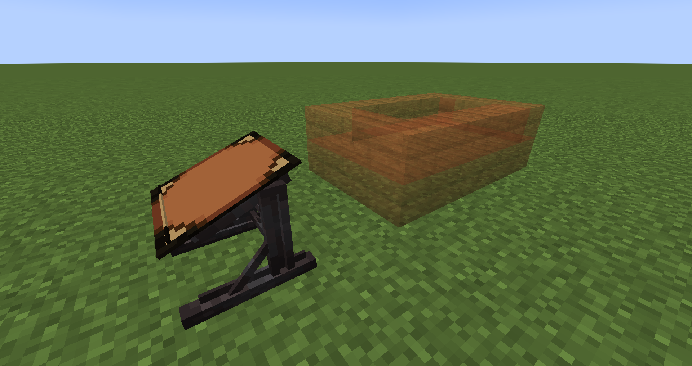
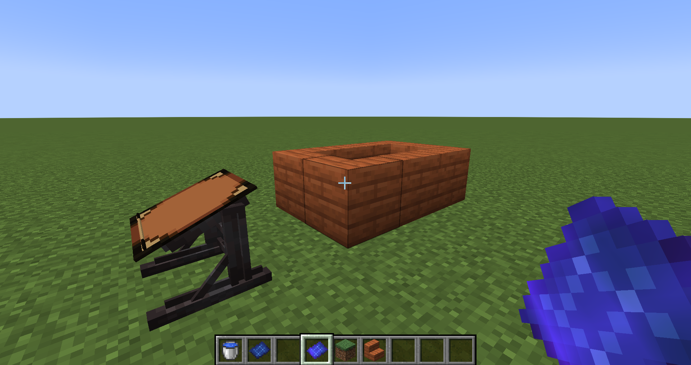
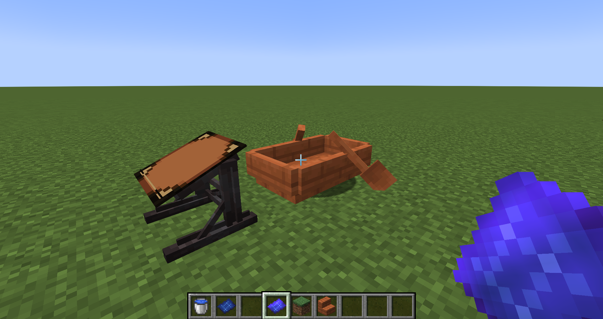

___

### Highly-configurable data-driven crafting recipes using multiblocks.

&nbsp;

 

___

## This mod is currently in beta and under active development! Please back up your worlds prior to and routinely following installation!

Are you a **modpack dev** who finds crafting planes, ships, cars and other such entities inside crafting tables boring?
Enough with that bullship, **this mod is for you!**

**_No Bullship_** is a mod that lets you craft these entities using a multiblock structure which **you** can define! Pretty much any block you can think of can be used, and may **include blockstates and NBT data!**
The entities you can make aren't restricted either; make any entity, including any NBT data! In the future, this mod will also allow you to disable drops - even hardcoded ones - for entities.
This will allow modpackers to more easily prevent obtaining entities in their inventories! [Learn more about how to make a **_No Bullship!_** data file here.](https://github.com/kawaiicakes/NoBullship/wiki)

This mod is intended for modpackers to use & configure; however, it will come with recipes for some mods in the near future.

---

# 📖 Information

## Quick How-To
1. Craft a schematic for the multiblock recipe you wish to make! 

2. Use the Workshop to display the recipe into the world!

3. Build stuff just like you would for an Iron Golem (Note: sideways and upside-down building will not work)

4. Right-click the multiblock with the schematic! 

## Features
- JEI compatibility for the Schematic Workshop!
- [Straight-forward datapack creation for multiblock & schematic recipes](https://github.com/kawaiicakes/NoBullship/wiki)
- Multiblocks may require extra items in the inventory to make!
- Supports NBT and blockstate data for both crafted entities and ingredient blocks!
- Compatible with nearly any mod!
- Lots of config options!

___

# 📝 In-Development Features

- JEI compatibility for multiblocks themselves
- Support for rendering block entities with NBT data in the workshop schematic previews
- More aggressive disposal of invalid recipes
- Permitting block and/or item tags to be used as multiblock ingredients
- NBT structure support; convert NBT structures to/from multiblock recipes!
- "Structure block" permitting reasonable performance for huge recipes (think over 20x20x20)
- Configurable drop prevention, even for hard-coded drops (e.g. Simple Planes planes)
- Configurable drops of blocks from multiblock recipe on entity death
- Cleaner API
- Packaged support for select mods! Read below!
- Miscellaneous custom blocks & items for use with this mod! Stuff like nails, wooden beams, etc.
- Miscellaneous improvements and bug fixes

---

# 💻 For Developers

Internationalization and misc PRs are welcomed!

## Modders
To add this mod as a dependency, using Curse Maven would probably the simplest route.
As a mod dev, you will probably be looking in the .api package for most of the things you'll need, and I've included some
documentation here and there. I'll get on improving it as I clean the API. [Further reading on the wiki.](https://github.com/kawaiicakes/NoBullship/wiki)

## Modpack Devs
Detailed info on creating datapacks for this mod may be found [here.](https://github.com/kawaiicakes/NoBullship/wiki) Otherwise, feel free to include this mod in your modpack! It was made specifically for modpackers!
Anyhow, don't expect the structure of data files for this mod to change. I will work hard to maintain them as they are now if possible and the format isn't difficult to work with; continued development of this mod notwithstanding.

---

# 💗 Credits & Thanks

The models and textures were made by me. Massive thanks to [Aspennly](https://twitter.com/Aspennly_) who made the very pretty icon for me!

Credit to **blackbirdantlion** on Discord for the lovely GUI texture. I've modified it a bit as I am reusing it from another project I am working on, which I have permission to do. You may find his Twitter [here](https://twitter.com/BlackbirdieAnt).

I also want to thank [embeddedt](https://github.com/embeddedt), his Discord community members and [1whohears](https://github.com/1whohears) for miscellaneous advising.

Also, I want to commend Kaupenjoe for his free Forge tutorials on YouTube to brief me on how some things work lol

___

Also, check out my very lovely sponsor and help me <s>take over</s> improve the world! I genuinely love DediMC's services, and its incredible customer support has won me over.

